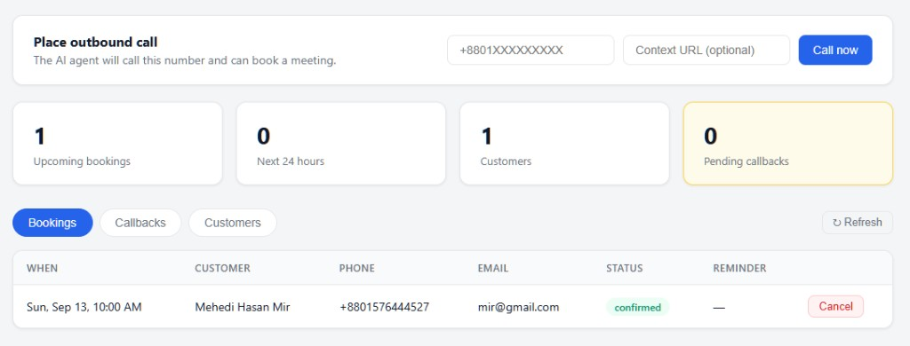

# AI Voice Agent — Phone Booking System

A phone-first booking assistant. Callers talk to an AI receptionist in real time (Twilio + OpenAI Realtime) and book a meeting on the **business calendar** — no customer OAuth required. Bookings are stored in the database (source of truth) and optionally synced to Google Calendar.


## Live demo

Deployed on Render:

| | URL |
| --- | --- |
| App | https://ai-voice-agent-lclw.onrender.com |
| Health check | https://ai-voice-agent-lclw.onrender.com/healthz |
| **Admin dashboard** | https://ai-voice-agent-lclw.onrender.com/admin |
| API docs | https://ai-voice-agent-lclw.onrender.com/docs |
| Voice webhook (Twilio) | `https://ai-voice-agent-lclw.onrender.com/voice/incoming` |

Sign in to the dashboard with `ADMIN_API_TOKEN` from the Render **Environment** tab.

On the free Render plan the service sleeps after idle time. Open `/healthz` first and wait for `{"status":"ok"}` before placing a call.



From the dashboard you can:

- Place an **outbound AI call** (E.164 number + optional context URL)
- See upcoming bookings, customers, and pending callbacks
- Cancel a booking (customer is emailed)

## Table of Contents

- [Live demo](#live-demo)
- [Features](#features)
- [Architecture](#architecture)
- [Installation](#installation)
- [Usage](#usage)
- [Configuration](#configuration-env)
- [API Reference](#api-reference)
- [Contributing](#contributing)
- [License](#license)

## Features

- Real-time phone conversations (Twilio Media Streams + OpenAI Realtime GA API)
- **Availability-first booking flow**: `check_availability` → confirm with the caller → `book_meeting` (name + email collected on the call)
- Customer profiles identified by caller ID (E.164 phone)
- Optional sync of bookings to a business Google Calendar (service account)
- Confirmation email (Gmail SMTP) with a one-click **cancel link**
- **Reminder email 1 hour before** each meeting (background task)
- Human fallback: `request_callback` saves the number and sends an SMS promise
- **Admin dashboard**: outbound calls, stats, bookings, customers, callbacks
- Website scraping to prime outbound calls with page context
- Docker + GitHub Actions CI; production deploy on Render (PostgreSQL)

## Architecture

```
Caller ──▶ Twilio ──▶ /voice/incoming (TwiML) ──▶ /media-stream (WebSocket)
                                                        │
                                            RealtimeBridge ⇄ OpenAI Realtime
                                                        │  tool calls
                                            VoiceToolRegistry
                                          ┌─────────┼──────────┐
                                 BookingService  EmailService  SmsService
                                          │
                              Database (SQLite locally / Postgres on Render)
                                          │ best-effort sync
                              Google Calendar (service account)
```

Key modules:

| Path | Responsibility |
| --- | --- |
| `app/db/` | SQLAlchemy models: `Customer`, `Booking`, `CallbackRequest` |
| `app/services/booking.py` | Availability, booking, cancellation, reminders (business-hours aware) |
| `app/services/business_calendar.py` | Google Calendar sync via service account (optional) |
| `app/services/notifications.py` | Gmail SMTP email + Twilio SMS |
| `app/services/voice_tools.py` | Tools: `check_availability`, `book_meeting`, `request_callback` |
| `app/services/openai_realtime.py` | Twilio ⇄ OpenAI audio bridge (GA Realtime API) |
| `app/services/reminders.py` | Background loop: reminder email 1 h before meetings |
| `app/api/routes/admin.py` | Token-protected admin REST API (including outbound calls) |
| `app/api/routes/public.py` | Public cancel page API |
| `static/admin/` | Admin dashboard (vanilla HTML/CSS/JS) |
| `static/cancel/` | Customer cancel page |

## Installation

### Prerequisites

- Python 3.11+
- A Twilio account with a phone number
- OpenAI API key
- Optional locally: ngrok. Production uses the Render URL instead.
- Optional: Google Cloud service account (calendar sync), Gmail App Password (emails)

### Setup

```bash
python -m venv .venv

# Windows (PowerShell)
.\.venv\Scripts\Activate.ps1

# macOS / Linux
source .venv/bin/activate

pip install -r requirements.txt
# Create your .env (see Configuration)
```

## Usage

### Live (Render)

1. Open https://ai-voice-agent-lclw.onrender.com/healthz and wait for `{"status":"ok"}`.
2. Open the [admin dashboard](https://ai-voice-agent-lclw.onrender.com/admin) and sign in.
3. **Outbound:** enter a number like `+8801XXXXXXXXX` and click **Call now**.
4. **Inbound:** call your Twilio number. Voice webhook must be:

   `https://ai-voice-agent-lclw.onrender.com/voice/incoming` (HTTP POST)

### Local

```bash
# 1) Start the API server
uvicorn server:app --reload --host 0.0.0.0 --port 8000

# 2) Start ngrok and copy the domain into .env as SERVER_HOST (no scheme)
ngrok http 8000

# 3) Point your Twilio number's Voice webhook to:
#    https://<YOUR_NGROK_DOMAIN>/voice/incoming

# 4) Open the admin dashboard
#    http://localhost:8000/admin   (sign in with ADMIN_API_TOKEN)

# 5) Optional: place an outbound call from the CLI
python scripts/outbound_call.py --phone +8801XXXXXXXXX

# Run the test suite
pytest
```

## Configuration (.env)

```dotenv
OPENAI_API_KEY=sk-proj-...

TWILIO_ACCOUNT_SID=ACxxxxxxxx
TWILIO_AUTH_TOKEN=xxxxxxxx
TWILIO_PHONE_NUMBER=+15551234567
# Production (no https://)
SERVER_HOST=ai-voice-agent-lclw.onrender.com

# Business rules
BUSINESS_NAME=Our Office
BUSINESS_TIMEZONE=Asia/Dhaka
BUSINESS_DAYS=sun,mon,tue,wed,thu
BUSINESS_OPEN=10:00
BUSINESS_CLOSE=18:00
SLOT_MINUTES=30

# Database (SQLite locally; Internal Database URL on Render)
DATABASE_URL=sqlite:///./voice_agent.db

# Google Calendar sync (optional)
GOOGLE_SERVICE_ACCOUNT_FILE=service_account.json
BUSINESS_CALENDAR_ID=yourbusiness@gmail.com

# Email via Gmail SMTP (App Password required)
GMAIL_ADDRESS=you@gmail.com
GMAIL_APP_PASSWORD=xxxxxxxxxxxxxxxx

# Admin dashboard token
ADMIN_API_TOKEN=change-me
```

### Google Calendar sync setup

1. In Google Cloud Console create a **service account** and download its JSON key as `service_account.json` in the project root.
2. Enable the **Google Calendar API** for the project.
3. Open your business Google Calendar → Settings → *Share with specific people* → add the service account email with **"Make changes to events"**.
4. Set `BUSINESS_CALENDAR_ID` (usually the calendar owner's email address).

If these are not configured the app still works — bookings are stored in the database only.

### Gmail SMTP setup

1. Enable 2-Step Verification on the Google account.
2. Google Account → Security → App passwords → create one for "Mail".
3. Set `GMAIL_ADDRESS` and `GMAIL_APP_PASSWORD`.

## API Reference

| Endpoint | Description |
| --- | --- |
| `GET /healthz` | Health check |
| `GET\|POST /voice/incoming` | Twilio voice webhook (returns TwiML) |
| `WS /media-stream` | Twilio Media Stream ⇄ OpenAI Realtime bridge |
| `GET /admin` | Admin dashboard UI |
| `GET /api/admin/stats` | Counters (requires `X-Admin-Token`) |
| `GET /api/admin/bookings` | List bookings (requires `X-Admin-Token`) |
| `POST /api/admin/bookings/{id}/cancel` | Cancel a booking (emails the customer) |
| `POST /api/admin/calls` | Place an outbound AI call (requires `X-Admin-Token`) |
| `GET /api/admin/customers` | List customers |
| `GET /api/admin/callbacks` | List callback requests |
| `POST /api/admin/callbacks/{id}/complete` | Mark a callback handled |
| `GET /cancel/{token}` | Customer-facing cancel page |
| `GET /api/public/bookings/{token}` | Booking details for the cancel page |
| `POST /api/public/bookings/{token}/cancel` | Cancel via emailed link |

## Contributing

1. Fork the repository and create a feature branch (`git checkout -b feat/my-feature`).
2. Install dependencies and run `pytest` to confirm your environment.
3. Make your changes. Add a test or reproduction script for non-trivial changes.
4. Open a pull request with a clear description of what changed and how to verify it.

Issues and suggestions are welcome via GitHub Issues.

## License

License not yet specified. Contact the repository owner for usage rights.
